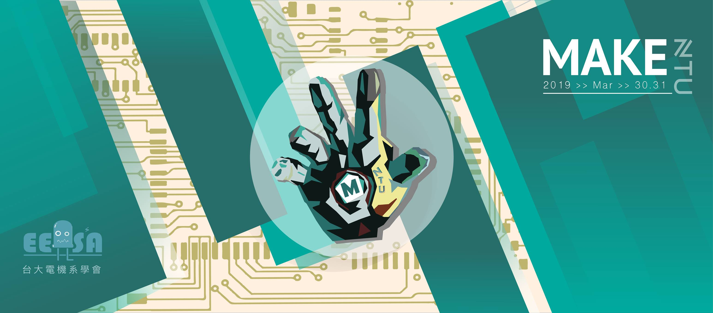

# MakeNTU 2019 workshop - FaceLock

MakeNTU2019 樹莓派工作坊教學 - 用 Microsoft Azure, OpenCV, Raspberry Pi 3 製作一個人臉置物櫃鎖

- slide link: https://bit.ly/MakeNTU2019
- 純圖文好讀版 & Code: https://github.com/voidism/MakeNTU2019_workshop





### 主題 - 人臉辨識鎖


### 使用場景
- 健身房、游泳池置物櫃...etc
- 設密碼 -> 容易忘記
- 用鑰匙 -> 帶著運動不方便
- 只需要短期借用


### 材料
- RPi 3 model B+
- 伺服馬達 x1
- 網路攝影機 或是 Pi Camera 擇一
- Azure API


## Microsoft Azure API 申請


### 辦帳號

如果有學校信箱，可直接申請教育試用版，免綁信用卡

https://azure.microsoft.com/zh-tw/free/students/


需要驗證學校的電子郵件


按同意，申請完成


### 開通API


來到 Azure 首頁


點選"建立資源"


點選"AI + 機器學習服務"，選"Face"


- 填入名稱、位置(server位置要記得，等等會用到)
- Pricing Tier 選 f0
- Resource group 按"新建"創一個


稍等一會就會顯示部署成功，可以按"釘選到儀表板"


從儀表板進入資源(右上角)


進入keys取得金鑰


複製下金鑰(任一支)，等等用


## RPI 基本操作


本次工作坊給大家的SD卡都已經灌好OS，如果需要自己灌，下載下面的映像檔，安裝一下[Etcher](https://www.balena.io/etcher/)燒錄進SD卡即可，此映像檔中已經裝好python3.6、miniconda、OpenCV，並允許ssh連線

[映像檔連結](https://drive.google.com/file/d/1olKMaWdfO_YNcoCCH810jgWVFGCI0X21/view)


## 連上RPI - 取得RPI內網ip - 法一 (正常人用這個)

映像檔設有兩組wifi名稱密碼，會自動連上，第一組是工作坊場地wifi(名稱：COBINHOOD_Guest, 密碼：Siam87/bills)。  
連上之後，借螢幕來接RPI的HDMI孔，直接用圖形化介面打開RPI的terminal打`ifconfig`，即可查詢內網ip(192.168.xxx.xxx)


inet 192.168.xxx.xxx 就是惹


## 連上RPI - 取得RPI內網ip - 法二  (不需螢幕，要有自己的wifi)


在開機之前先在SD卡最外面放入一個檔`wpa_supplicant.conf`，內容跟如下，wifi名稱密碼可以自己設想要的(自己的手機熱點)：
```bash
ctrl_interface=DIR=/var/run/wpa_supplicant GROUP=netdev
update_config=1
country=TW
network={
    ssid="WIFI名稱，要是英數字"
    psk="WIFI密碼"
    key_mgmt=WPA-PSK
}
```


如果是手機分享的網路，透過手機的基地台設定可以察看所有連上裝置的內網ip


有了內網ip等等就可以直接ssh連線


如果不是手機熱點，安裝使用 [Angry IP Scanner](https://angryip.org/download/)來掃IP，先讓電腦連接上跟RPI一樣的wifi，掃`192.168.0.0 ~ 192.168.0.255` 之間的內網IP，名稱是`raspberry`的就是RPI的內網IP。 


## 有了RPI內網ip的下一步

找到RPI的內網IP位置之後，電腦也已經連接上跟RPI一樣的網路，就可以使用Terminal ssh連線`ssh pi@192.168.xx.xx`，password:`raspberry` 


## 連上RPI - 法三

從頭到尾都接螢幕。。。
只要比賽當天自行攜帶螢幕，就可以接螢幕接到爽，不會有這些問題了喔～鳩咪～


### 想看RPI畫面怎麼辦

但因為ssh連線只能用文字介面，沒辦法看到RPI桌面畫面，想用VNC連RPI看畫面，需要裝一下tightvncserver：(打在ssh連線後的terminal)

```bash
sudo apt-get install tightvncserver
```
設定VNC密碼，執行:
```bash
vncpasswd
```
他會叫你輸入想要的8位數密碼，等等會用到。

----

## 使用VNC client

先在RPI端執行`tightvncserver`。

用mac的話開啟Finder>>前往>>連接伺服器


打入  `vnc://{RPI的內網IP}:5901` 如：`vnc://192.168.0.104:5901`。  


之後按連線輸入剛剛設定的密碼，即可連上。


如果是Windows請下載VNC的client端軟體realvnc  
[https://www.realvnc.com/en/connect/download/viewer/](https://www.realvnc.com/en/connect/download/viewer/)


打入 192.168.xxx.xxx:5901


會說沒加密，請按繼續


會叫你輸入密碼，帳號不需要，密碼就是你剛剛設的八位數字
如果他要你打帳號，應該是你沒有在RPI端執行`tightvncserver`的緣故


連上了！

(如果下次開機，也想使用VNC，記得要在RPI端再打一次`tightvncserver`，才可以用喔)


## 主程式

----

### 下載本專案程式碼

進入ssh連線之後(或是使用VNC後，開啟rpi本身的terminal)，執行：

```bash
git clone https://github.com/voidism/MakeNTU2019_workshop 
# 這行是要從Github上複製一份程式碼

cd MakeNTU2019_workshop 
# 這行是要進入剛剛下載下來的code的資料夾
```


### 前置作業 (硬體)

將 servo motor 與 GPIO pin腳連接:
  - 紅 <=> pin 2  (接VDD)
  - 棕 <=> pin 6  (接地)
  - 橘 <=> pin 11 (信號來源)


如果用 web-cam，將 web-cam 用 USB 與 RPi 相接


如果是用 pi camera，直接接CSI介面專用插孔
並且要將資料夾中`face_lock_system.py`的第四行改成`from pi_camera import Scanner`


### 填空題(1)

- `servo.py`的第18行，有個 `# TODO` 的部分要填
- 這一行是要決定傳入Servo的信號波型
- 直接填 

```python
duty_cycle = (0.05 * self.PWM_FREQ) + (0.19 * self.PWM_FREQ * angle / 180)
```
> 原理：[Raspberry Pi 3 Mobel B 利用 PWM 控制伺服馬達](https://blog.everlearn.tw/%E7%95%B6-python-%E9%81%87%E4%B8%8A-raspberry-pi/raspberry-pi-3-mobel-3-%E5%88%A9%E7%94%A8-pwm-%E6%8E%A7%E5%88%B6%E4%BC%BA%E6%9C%8D%E9%A6%AC%E9%81%94)


### Run Code

1. 執行 `python3 -i servo.py`:

```python
pi@raspberrypi:~/MakeNTU2019_workshop $ python -i servo.py
>>> s = Servo() #建一個伺服馬達 Object
>>> s.turn(90)  #轉到90度
>>> s.turn(0)   #轉到0度
```

確認伺服馬達是否運作正常。


> `>>> ` 開頭的指令都是要在進入 python interactive介面之後才打的，不是打在外面的command line喔。


2. 如果是用web-cam，跑  
`python3 -i camera.py`:  
如果是用picamera，跑  
`python3 -i pi_camera.py`:  

```python
pi@raspberrypi:~/MakeNTU2019_workshop $ python -i camera.py
>>> s = Scanner(0)          #建一個相機 Object，0是相機ID
>>> s.get_photo("test.png") #拍下照片，存成"test.png"
```

確認資料夾內是否出現拍下的照片 `"test.png"`。
(注意picamera有排線的一側是對應到照片下方)


## 前置作業 (設定 API Key)

- 進入資料夾後，在程式碼 `face_api.py` 的第6行，把  
`###your azure api key###`和`###you server location###`  
改成自己剛剛在Azure申請好的的key跟server網址。server網址是server位置加上後面一串字，如：West US 就填 
```
westus.api.cognitive.microsoft.com
```


server 位置 網址對應

```perl
West US - westus.api.cognitive.microsoft.com
West US 2 - westus2.api.cognitive.microsoft.com
East US - eastus.api.cognitive.microsoft.com
East US 2 - eastus2.api.cognitive.microsoft.com
West Central US - westcentralus.api.cognitive.microsoft.com
South Central US - southcentralus.api.cognitive.microsoft.com
West Europe - westeurope.api.cognitive.microsoft.com
North Europe - northeurope.api.cognitive.microsoft.com
Southeast Asia - southeastasia.api.cognitive.microsoft.com
East Asia - eastasia.api.cognitive.microsoft.com
Australia East - australiaeast.api.cognitive.microsoft.com
Brazil South - brazilsouth.api.cognitive.microsoft.com
Canada Central - canadacentral.api.cognitive.microsoft.com
Central India - centralindia.api.cognitive.microsoft.com
UK South - uksouth.api.cognitive.microsoft.com
Japan East - japaneast.api.cognitive.microsoft.com
Central US - centralus.api.cognitive.microsoft.com
France Central - francecentral.api.cognitive.microsoft.com
Korea Central - koreacentral.api.cognitive.microsoft.com
Japan West - japanwest.api.cognitive.microsoft.com
North Central US - northcentralus.api.cognitive.microsoft.com
```


### 填空題(2)

- `face_api.py`的第37行，有個 `# TODO`要填
- 這裡是決定傳給Azure的request內容
- 直接填入
```python=37
self.conn.request("POST", "/face/v1.0/detect?%s" % self.params, self.body, self.DetectHeaders)
```


> 原理:
> `self.body` 是上一行定義的，就是把圖片用binary方式打開  
> `self.DetectHeaders` 裡面放的是我們的key跟檔案格式，已經在第七行定義好了  
> `self.params` 則是我們指定API要回傳給我們的東西，在19行已經定義好，我們設成只要回傳 FaceId。  


3. 跑 `python3 -i face_api.py`:

```python
pi@raspberrypi:~/MakeNTU2019_workshop $ python -i face_api.py
>>> s = AzureAPI()          #創一個API Object
>>> s.GetFaceId("test.png") #這裡會丟出一個API request
```

確認 API 是否有回傳資料(如下)。  


注意`test.png`需要是臉部的照片，才會有回傳值，否則偵測不到臉會回傳`[]`，方向錯誤或模糊也容易偵測不到。


### 填空題(3)

- `main_gui.py`的第11行， `# TODO` 的部分要填
- 這裡是定義各按鈕按下後，要執行的function內容
- 直接填入

```python=11
    def register(self):
        self.displayText["text"] = self.F.Register()
    def checkout(self):
        self.displayText["text"] = self.F.Checkout()
    def unlock(self):
        self.displayText["text"] = self.F.Unlock()
    def lock(self):
        self.displayText["text"] = self.F.Lock()
```

> 原理：按下 Register 按鈕後，會執行 `register()`
> 會去呼叫人臉鎖系統 `self.F` 的 `Register()` 函數
> 並且把函數回傳值顯示到 `self.displayText["text"]`


4. 如果一切順利，就可以跑  
`python main_gui.py`了。

正常執行下會出現GUI小視窗：


## 主程式使用說明


### Flow

程式一開始在未註冊的地方，註冊完可以進入Lock/Unlock的輪迴，  
輪迴中Unlock需要臉部解鎖，要交給下一位使用者的時候按Checkout，  
最後一次臉部解鎖確認身份，跳出輪迴。  


1. 先將臉部對準 camera，按 register 註冊，登錄成功後 Lock 會打開，在 Checkout 之前無法再次註冊


2. 按 Lock 將鎖鎖上後，下次可再將臉部對準 web-cam 按 Unlock 開鎖，若是其他人則無法開鎖


3. 在上鎖的情況下可按將臉部對準 camera 按 Checkout，確認是本人後即可登出，並可由下一位使用者再次註冊


4. 所有錯誤操作皆會顯示提示字眼於下方那行字，如：人臉沒有對準鏡頭，會顯示 `Face Not Detected!`，操作成功也會顯示`Locked!`或`Unlocked!`等等。


> 成功Checkout!


## DeBug
常見問題


剛剛有說，用picamera的人要把資料夾中`face_lock_system.py`的第四行改成`from pi_camera import Scanner`  
沒做的話，相機就拍了一張空照片傳到Azure  


### Q: 明明有對準，怎麼一直Face Not Detect?
可以把 `face_lock_system.py`中出現三次的`os.remove(temp_name)`給註解掉，拍完的照片就不會消失，可以看看傳上Azure的圖片到底是拍成怎樣。


### Q. 懶得做填空題？
```bash
git checkout e52cb6244f4c31857d7e9cc38f3fa692e1e88d5e
```
